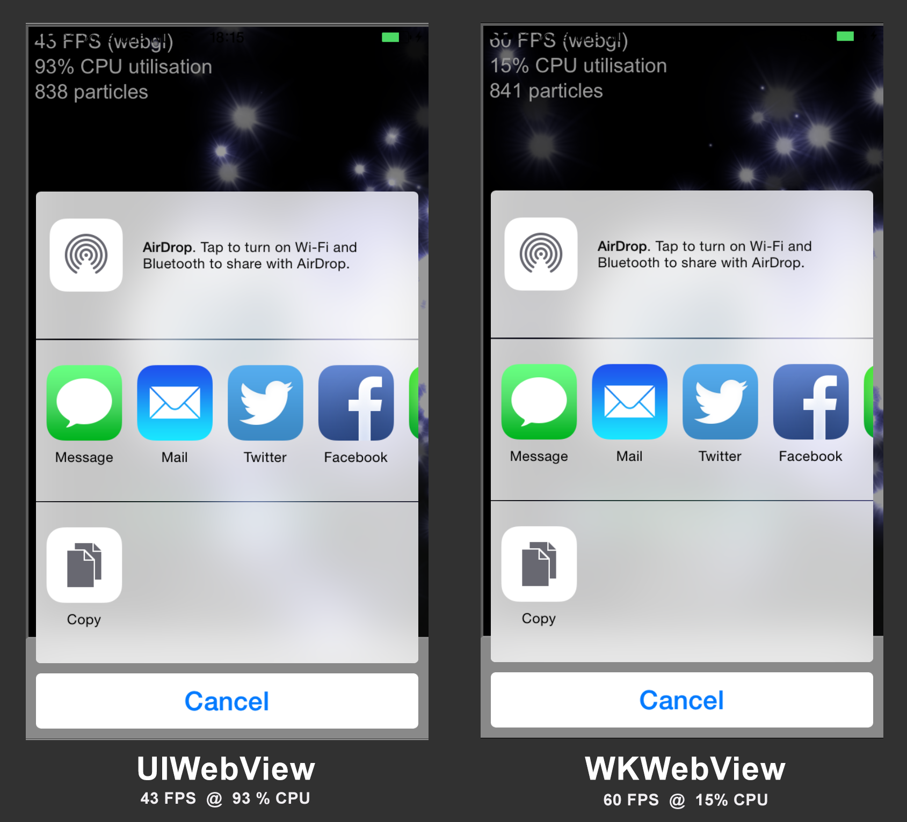

# Cordova WKWebView Polyfill Plugin
by [Eddy Verbruggen](http://twitter.com/eddyverbruggen) / [Telerik](http://www.telerik.com)

## 0. Index

1. [Description](#1-description)
2. [Screenshot](#2-screenshot)
3. [Installation](#3-installation)
4. [Changelog](#4-changelog)
5. [Credits](#5-credits)
6. [License](#6-license)

## 1. Description

_BETA_ (a little less with __0.1.0__) - things may break, [please post your feedback :)](https://github.com/EddyVerbruggen/cordova-plugin-wkwebview/issues)

* Allows you to use the new WKWebView on iOS 8 (the simulator is supported as well).
* Falls back to UIWebView on iOS 7 and lower.
* Will hopefully cease to exist soon (when Apple releases a fixed WKWebView so Cordova can use it without the hacks I needed to apply).
* As a matter of fact, [Apache is working on a similar plugin (which you can't use at the moment of writing)](https://github.com/apache/cordova-plugins/tree/master/wkwebview-engine) which I came across after releasing version 0.1.1. It targets Cordova 3.7.0 and up whereas this plugin is supported on 3.0.0 an up. 
* Your log will show some warnings but that's almost entirely down to the (otherwise excellent) embedded [CocoaHTTPServer](https://github.com/robbiehanson/CocoaHTTPServer).

### TIPS

* [Ionic](http://ionicframework.com/) tip: to prevent flashes of a black background, make sure you set `ion-nav-view`'s `background-color` to `transparent`.
* If you need the [device plugin](org.apache.cordova.device), use at least Cordova-iOS 3.6.3 (deviceready never fires with 3.5.0 due to a currently unknown reason).

### BUGS / Caveats

* __Fixed in 0.2.0__: Note that at the moment [LocalStorage is NOT automatically transferred from the old webview to the new one](#7). This is not an issue for new apps, but it is when you drop it into an existing one and store f.i. logins in localstorage.

## 2. Screenshot
This image shows the [SocialSharing plugin](https://github.com/EddyVerbruggen/SocialSharing-PhoneGap-Plugin) in action while running [a performance test](https://www.scirra.com/demos/c2/particles/) in an iframe on my iPhone 6 (older devices show an even larger difference).
It's a screenshot of the [demo app](demo/index.html).



## 3. Installation

```
$ cordova plugin add https://github.com/EddyVerbruggen/cordova-plugin-wkwebview
$ cordova prepare
```

No need for anything else - you can now open the project in XCode 6 if you like.

## 4. Changelog
* __0.2.1__  LocalStorage sync between UIWebView and WKWebView - on a real device as well
* __0.2.0__  LocalStorage sync between UIWebView and WKWebView - on a simulator only
* __0.1.3__  Compatibility with [InAppBrowser](https://github.com/apache/cordova-plugin-inappbrowser)
* __0.1.2__  Compatibility with plugins like [Toast](https://github.com/EddyVerbruggen/Toast-PhoneGap-Plugin) which add a subview to the webview (they didn't show)
* __0.1.1__  Cleanup to get rid of a few (deprecation) warnings - lots left (on purpose) because they're thrown by a 3rd party framework and can be safely ignored
* __0.1.0__  Added support for loading local files via XHR. This should now transparently work for $.ajax, AngularJS templateUrl's, etc. To this end the plugin adds an embedded HTTP server on port 12344 which is stopped when the app is put to sleep or exits.
* __0.0.1__  Initial version

## 5. Credits
This plugin was inspired by the hard work of the Apache Cordova team [(and most notably Shazron)](https://github.com/shazron/WKWebViewFIleUrlTest).

## 6. License

[The MIT License (MIT)](http://www.opensource.org/licenses/mit-license.html)

Permission is hereby granted, free of charge, to any person obtaining a copy
of this software and associated documentation files (the "Software"), to deal
in the Software without restriction, including without limitation the rights
to use, copy, modify, merge, publish, distribute, sublicense, and/or sell
copies of the Software, and to permit persons to whom the Software is
furnished to do so, subject to the following conditions:

The above copyright notice and this permission notice shall be included in
all copies or substantial portions of the Software.

THE SOFTWARE IS PROVIDED "AS IS", WITHOUT WARRANTY OF ANY KIND, EXPRESS OR
IMPLIED, INCLUDING BUT NOT LIMITED TO THE WARRANTIES OF MERCHANTABILITY,
FITNESS FOR A PARTICULAR PURPOSE AND NONINFRINGEMENT. IN NO EVENT SHALL THE
AUTHORS OR COPYRIGHT HOLDERS BE LIABLE FOR ANY CLAIM, DAMAGES OR OTHER
LIABILITY, WHETHER IN AN ACTION OF CONTRACT, TORT OR OTHERWISE, ARISING FROM,
OUT OF OR IN CONNECTION WITH THE SOFTWARE OR THE USE OR OTHER DEALINGS IN
THE SOFTWARE.
